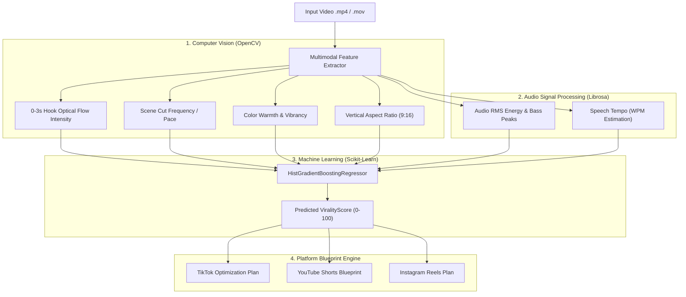

# 🚀 AI Virality Predictor & Multi-Platform Optimizer

[](https://www.python.org/)
[](https://fastapi.tiangolo.com/)
[](https://nextjs.org/)
[](https://opencv.org/)
[](https://scikit-learn.org/)
[]()
[](LICENSE)

> **AI Virality Predictor** is a video intelligence and social media optimization platform that predicts the retention and viral engagement potential of short-form videos (YouTube Shorts, TikTok, Instagram Reels) using Computer Vision, Audio Signal Processing, and Machine Learning.

---

## 🔄 Project Evolution & Research Context

- **Phase 1 (NIT Kurukshetra Research Internship)**: Initial research prototype built in **Flask** to explore multimodal feature extraction algorithms — specifically OpenCV optical flow motion tracking on opening frames (0–3s hook analysis) and Librosa acoustic frequency/RMS energy extraction.
- **Phase 2 (Full-Stack Engineering Expansion)**: Independently redesigned and expanded into a modular full-stack application with a **FastAPI backend** and a **Next.js 14 frontend** with multi-platform optimization blueprints, diagnostic reporting, and reproducible ML benchmarks.
- *Detailed evolution breakdown*: See [`docs/INTERNSHIP_EVOLUTION.md`](docs/INTERNSHIP_EVOLUTION.md).

---

## 🏗️ System Architecture & Multimodal Pipeline



---

## 📊 Machine Learning Model & Benchmark Results

### Model Evaluation & Comparison
The predictive model uses Scikit-Learn's `HistGradientBoostingRegressor` trained on a standardized **Synthetic Benchmark Dataset** ($N=10,000$, 80/20 train-test split) parameterized by empirical social video distributions.

| Model | $R^2$ Score (Higher is Better) | RMSE (Lower is Better) | MAE (Lower is Better) |
| :--- | :--- | :--- | :--- |
| **Linear Regression** | `0.8824` | `4.5194` | `3.7105` |
| **Ridge Regression** | `0.8824` | `4.5195` | `3.7105` |
| **HistGradientBoosting Regressor (Selected)** | `0.8669` | `4.8081` | `3.9141` |
| **Gradient Boosting Regressor** | `0.8651` | `4.8396` | `3.9203` |
| **Random Forest Regressor** | `0.8007` | `5.8836` | `4.6765` |

### Key ML Artifacts:
- **Feature Importance**: [`backend/artifacts/feature_importance.png`](backend/artifacts/feature_importance.png)
- **Predicted vs Actual**: [`backend/artifacts/predicted_vs_actual.png`](backend/artifacts/predicted_vs_actual.png)
- **Model Comparison**: [`backend/artifacts/model_comparison.png`](backend/artifacts/model_comparison.png)
- **Residual Distribution**: [`backend/artifacts/residual_distribution.png`](backend/artifacts/residual_distribution.png)

---

## 📁 Repository Structure

```text
ai-virality-predictor/
├── .github/workflows/ci.yml       # GitHub Actions CI Workflow
├── backend/
│   ├── artifacts/                 # Generated plots and evaluation JSONs
│   │   ├── feature_importance.png
│   │   ├── model_comparison.png
│   │   ├── predicted_vs_actual.png
│   │   └── model_comparison.json
│   ├── dataset_loader.py          # Synthetic benchmark dataset generator
│   ├── train_model.py             # HistGradientBoosting training pipeline
│   ├── compare_models.py          # Baseline model comparison script
│   ├── generate_artifacts.py      # Artifacts and visualization generator
│   ├── vision_audio_extractor.py  # OpenCV & Librosa feature extractor
│   ├── main.py                    # FastAPI application & REST endpoints
│   ├── virality_model.pkl         # Trained model weights
│   ├── model_metadata.json        # Evaluation metadata
│   └── requirements.txt
├── docs/
│   ├── DATASET.md                 # Benchmark dataset documentation
│   ├── MODEL_CARD.md              # Model card & permutation importance
│   ├── EXPERIMENTS.md             # Baseline model comparison results
│   └── INTERNSHIP_EVOLUTION.md    # Research prototype to full-stack platform
├── frontend/
│   ├── src/                       # Next.js 14 React frontend
│   └── package.json
├── tests/                         # Pytest test suite (9 unit tests)
├── ML_INTERVIEW_NOTES.md          # Technical interview Q&A guide
├── LICENSE                        # MIT License
└── README.md
```

---

## ⚡ Quick Start (Local Setup)

### 1. Backend Server (FastAPI)
```bash
cd backend

# Create virtual environment
python -m venv venv

# Windows
venv\Scripts\activate
# Linux/macOS
source venv/bin/activate

# Install dependencies
pip install -r requirements.txt
pip install pytest matplotlib

# Run model evaluation & artifact generation
python generate_artifacts.py

# Start FastAPI server
uvicorn main:app --reload --port 8000
```
> FastAPI Docs: `http://127.0.0.1:8000/docs`

### 2. Run Test Suite
```bash
pytest tests/ -v
```

### 3. Frontend Application (Next.js)
```bash
cd frontend
npm install
npm run dev
```
> Web Application: `http://localhost:3000`

---

## 🎯 Technical Interview Discussion Points

- See [`ML_INTERVIEW_NOTES.md`](ML_INTERVIEW_NOTES.md) for detailed interview preparation covering:
  - Synthetic benchmark dataset vs live social media data.
  - Why `HistGradientBoostingRegressor` was chosen.
  - Optical flow computation via OpenCV.
  - Permutation feature importance analysis.
  - Real-world viral prediction limitations.

---

## 📄 License
This project is licensed under the [MIT License](LICENSE).