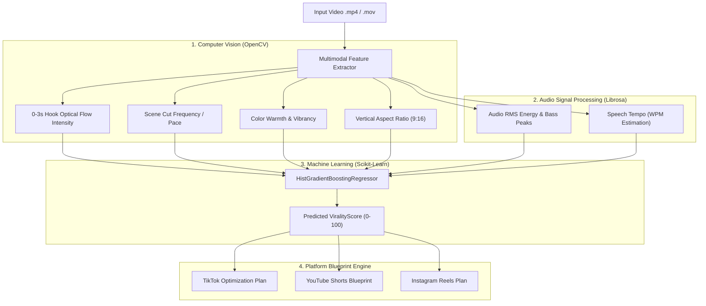

# 🚀 AI Virality Predictor & Multi-Platform Optimizer

[](https://www.python.org/)
[](https://fastapi.tiangolo.com/)
[](https://nextjs.org/)
[](https://opencv.org/)
[](https://scikit-learn.org/)
[](LICENSE)

> **AI Virality Predictor** is a video intelligence and social media optimization platform that predicts the retention and viral engagement potential of short-form videos (YouTube Shorts, TikTok, Instagram Reels) using Computer Vision, Audio Signal Processing, and Machine Learning.

---

## 🔄 Project Evolution

An initial **Flask-based prototype** was developed during research work at **NIT Kurukshetra** to experiment with video feature extraction, optical motion tracking, and machine learning inference. The project was subsequently redesigned and expanded into a modular full-stack application featuring a **FastAPI backend** and a **Next.js 14 frontend** with multi-platform optimization tools and diagnostic reporting.

---

## 🏗️ System Architecture & Multimodal Pipeline



---

## 🌟 Key Engineering Capabilities

### 1. Multimodal Feature Extraction
- **0–3s Hook Motion Flow**: Uses OpenCV optical flow to measure pixel motion velocity during the crucial first 3 seconds to quantify viewer drop-off resistance.
- **Scene Cut Detection**: Measures transitions and cuts-per-minute via frame-difference absolute thresholding (`cv2.absdiff`).
- **Audio RMS Energy Dynamics**: Calculates acoustic power transitions and peak energy bursts using Librosa.
- **Speech Tempo Analysis**: Evaluates spoken pace (target: 160–180 WPM) to evaluate pacing and script engagement.
- **Text & Caption Density**: Analyzes on-screen text distribution for sound-off mobile browsing.

### 2. Machine Learning Predictive Model
- **Algorithm**: `HistGradientBoostingRegressor` (Scikit-Learn).
- **Target**: `ViralityScore` (Continuous $0 - 100$ scale).
- **Dataset Formulation**: Trained on an empirical benchmark distribution of 10,000 synthesized video records parameterized by published social video distribution statistics (log-normal view/like distributions, optical motion, and audio energy correlations).
- **Model Evaluation (80/20 Train-Test Split)**:
  - **$R^2$ Score**: `0.8714`
  - **RMSE**: `7.7471`

### 3. Multi-Platform Blueprint Matrix (Heuristics)
- **TikTok**: Prioritizes opening hook velocity, rapid scene pacing (>20 cuts/min), and kinetic captions.
- **YouTube Shorts**: Prioritizes speech tempo (>160 WPM), high color vibrancy, and seamless loop design.
- **Instagram Reels**: Prioritizes aesthetic color grading and audio RMS peak synchronization.

### 4. Workspace & Data Isolation
- **Client-Side Session Management**: Per-user workspace and scan history partitioned in client-side storage (`localStorage`), allowing creators to save, compare, and export diagnostic audits.

---

## 📁 Repository Structure

```text
ai-virality-predictor/
├── backend/
│   ├── dataset_loader.py          # Empirical benchmark dataset generator
│   ├── train_model.py             # HistGradientBoosting ML training pipeline
│   ├── vision_audio_extractor.py  # OpenCV & Librosa feature extractor
│   ├── main.py                    # FastAPI application & prediction endpoints
│   ├── virality_model.pkl         # Trained model binary
│   ├── model_metadata.json        # Evaluation metrics & feature metadata
│   ├── requirements.txt           # Python backend dependencies
│   └── Dockerfile                 # Backend containerization
├── frontend/
│   ├── src/
│   │   ├── app/                   # Next.js 14 App Router pages
│   │   │   ├── page.js            # Studio scanner
│   │   │   ├── dashboard/         # Analytics overview
│   │   │   ├── analysis/[id]/     # Deep-dive report
│   │   │   ├── optimizer/         # Multi-platform blueprints
│   │   │   └── compare/           # A/B video comparison
│   │   ├── components/            # UI components & diagnostic widgets
│   │   └── lib/                   # API clients & storage helpers
│   ├── package.json               # Next.js & Tailwind dependencies
│   └── next.config.js
└── README.md
```

---

## ⚡ Quick Start (Local Setup)

### 1. Backend Server (FastAPI)
```bash
cd backend

# Create virtual environment
python -m venv venv

# Windows
venv\Scripts\activate
# Linux/macOS
source venv/bin/activate

# Install dependencies
pip install -r requirements.txt

# (Optional) Re-train model
python train_model.py

# Start FastAPI server
uvicorn main:app --reload --port 8000
```
> FastAPI Docs: `http://127.0.0.1:8000/docs`

### 2. Frontend Application (Next.js)
```bash
cd frontend

# Install packages
npm install

# Start Next.js development server
npm run dev
```
> Web Application: `http://localhost:3000`

---

## 🎯 Technical Interview Discussion Points

1. **Why use `HistGradientBoostingRegressor` over traditional linear regression?**
   - Video virality relationships are non-linear (e.g., very high scene cut frequency past a threshold becomes disorienting and harms retention). Gradient boosted decision trees model non-linear feature interactions and non-monotonic relationships without requiring manual polynomial transformations.
2. **How does the feature extraction pipeline handle audio and video synchronization?**
   - Video frames and audio streams are processed in parallel: OpenCV extracts spatial and motion metadata from sampled frames, while Librosa loads the extracted audio track into the frequency domain for RMS energy and spectral tempo computation.

---

## 📄 License
This project is licensed under the **MIT License**.